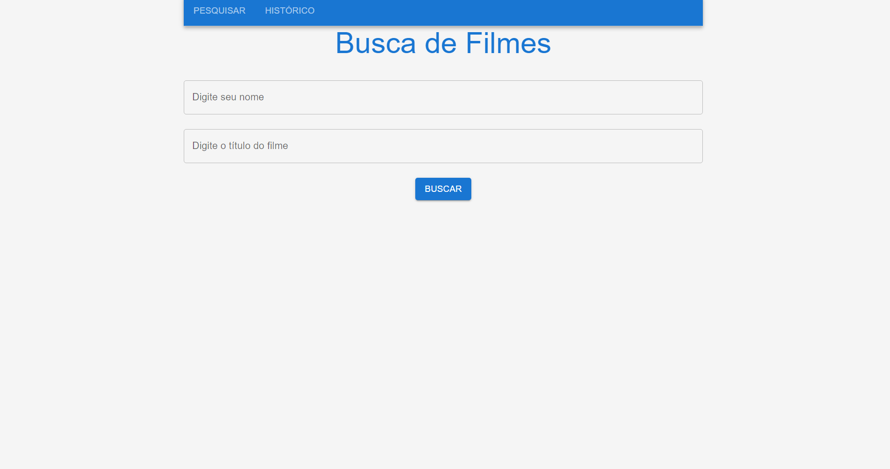
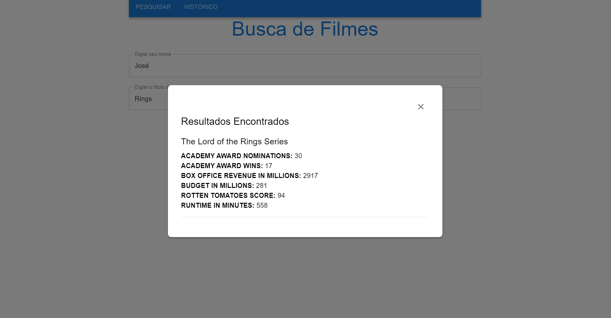
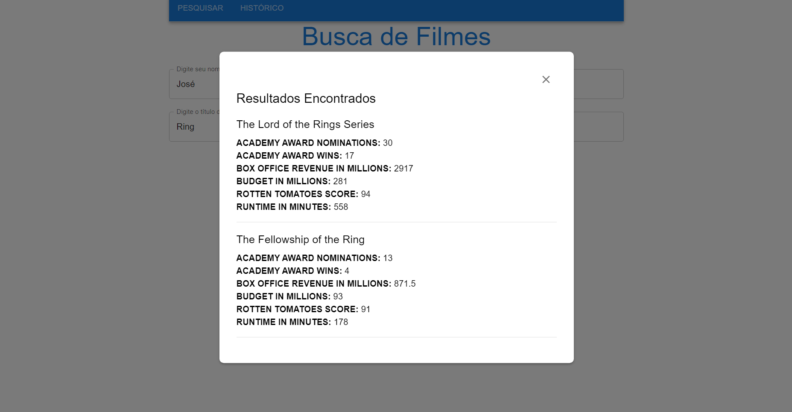
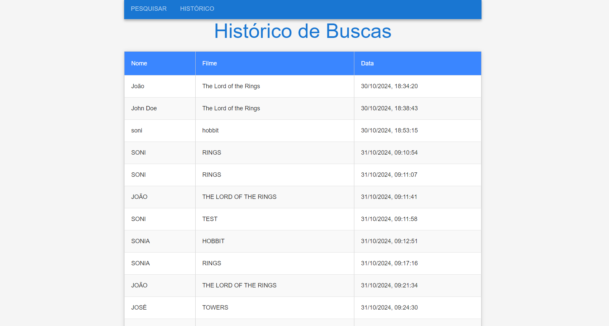

# Aplicação para Busca de Filmes 🎬

## Descrição do Projeto

Esta aplicação consiste em um sistema de busca de filmes, utilizando uma arquitetura baseada em microserviços, com um **backend** desenvolvido em Python (Flask) e um **frontend** em React. A aplicação é containerizada usando Docker e Docker Compose, permitindo uma fácil implantação e integração entre os serviços.

O backend se comunica com a API pública para buscar informações de filmes sobre **Senhor dos Anéis**, enquanto o frontend fornece uma interface interativa para que os usuários façam buscas e visualizem o histórico. O histórico das pesquisas é armazenado em um banco de dados MongoDB.

## 📂 Estrutura do Projeto

```
/MOVIE_SEARCH_APP
  /backend
    /routes
      history.py
      movies.py
      search.py
    .gitignore
    app.py
    config.py
    db.py
    Dockerfile
    requirements.txt
    .env
  /ui
    /public
    /src
      App.js
      HistoryPage.js
      SearchPage.js
      index.css
      index.js
    Dockerfile
    package.json
    .env
  docker-compose.yml
```

- **backend**: Contém a lógica da API em Flask que processa as requisições de busca e armazena os históricos no MongoDB.
- **ui**: Diretório do front-end em React, responsável pela interface do usuário.
- **docker-compose.yml**: Arquivo de configuração para orquestrar os contêineres Docker do backend, frontend e banco de dados MongoDB.

## 🛠️ Tecnologias Utilizadas

- **Backend**: Python, Flask, Flask-CORS, PyMongo.
- **Frontend**: React, Material UI.
- **Banco de Dados**: MongoDB.
- **Containerização**: Docker, Docker Compose.

## 📋 Pré-requisitos

- Docker e Docker Compose instalados.
- Node.js e npm/yarn instalados (para desenvolvimento do frontend).
- Python 3 e pip instalados (para desenvolvimento do backend).

## ⚙️ Configuração do Backend

### Dependências

As dependências do backend estão listadas no arquivo `requirements.txt`:

```
Flask
pymongo
flask-cors
```

### Arquivo `.env`

No diretório `backend`, crie um arquivo `.env` com o seguinte conteúdo:

```
API_KEY=YOUR_SECRET_API_KEY_HERE
```

Isso armazena a chave da API de forma segura.

No código do backend, as variáveis do `.env` são carregadas usando:

```python
API_KEY = os.getenv('API_KEY')
headers = {"Authorization": f"Bearer {API_KEY}"}
```

## 🐳 Docker Compose

O arquivo `docker-compose.yml` é responsável por gerenciar os serviços do backend, frontend e MongoDB. Ele orquestra a construção e execução de todos os contêineres necessários para a aplicação.

### Serviços

- **Backend**: Implementado em Python/Flask, expõe a porta `5000`.
- **Frontend**: Implementado em React e expõe a porta `3000`.
- **DB (MongoDB)**: Utiliza a imagem oficial do MongoDB e expõe a porta `27017` para comunicação com o backend.

## 🚀 Executando a Aplicação

Para executar a aplicação, siga os passos abaixo:

1. Clone o repositório para sua máquina local.
2. Navegue até o diretório raiz do projeto:
3. Construa e inicie os contêineres:

   ```bash
   docker-compose up --build
   ```

4. Acesse o Front-end em [http://localhost:3000](http://localhost:3000).
5. Acesse o Back-end em [http://localhost:5000](http://localhost:5000).

## ✨ Funcionalidades

### Página de Pesquisa

Permite ao usuário buscar por filmes e obter resultados em tempo real. A comunicação entre o front-end e o back-end é feita por requisições HTTP, e os resultados são apresentados ao usuário de forma dinâmica.

### Página de Histórico

Exibe um histórico de todas as pesquisas realizadas pelos usuários. Esses dados são armazenados no MongoDB, garantindo persistência.

## 🔒 Segurança

As chaves de API são armazenadas em arquivos `.env` tanto no backend, garantindo que informações sensíveis não fiquem expostas no código-fonte.

## ⚠️ Observações

- Certifique-se de que as portas `3000`, `5000` e `27017` estejam livres em sua máquina antes de executar os contêineres.
- Para parar a execução dos contêineres, utilize `CTRL+C` no terminal ou execute:

  ```bash
  docker-compose down
  ```

## 🤝 Contribuindo

Contribuições são bem-vindas! Sinta-se à vontade para abrir issues ou pull requests para melhorias. Sugestões para otimização do código, novas funcionalidades e melhorias na documentação são apreciadas.

## 📄 Licença

Este projeto está sob a licença MIT. Consulte o arquivo `LICENSE` para mais detalhes.

---

### 📷 Screenshots





